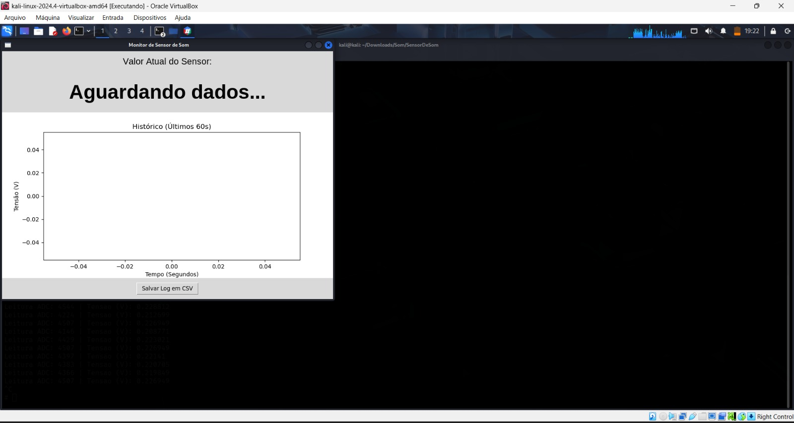
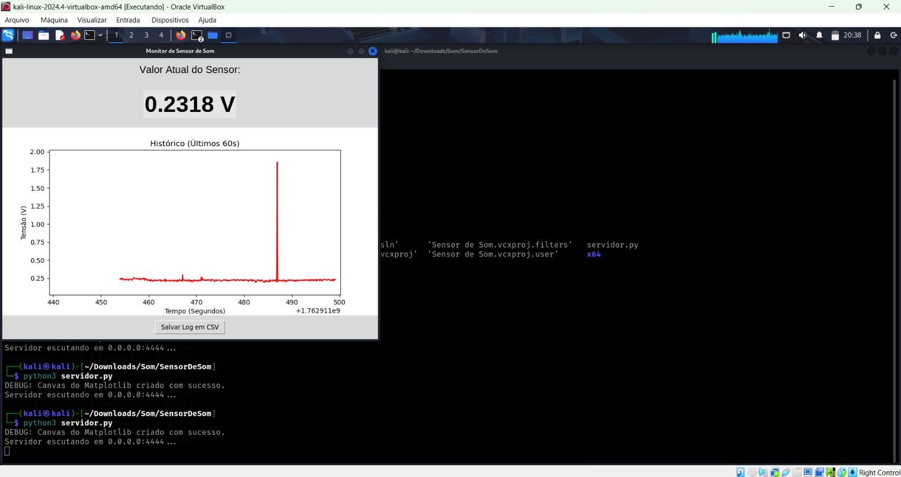
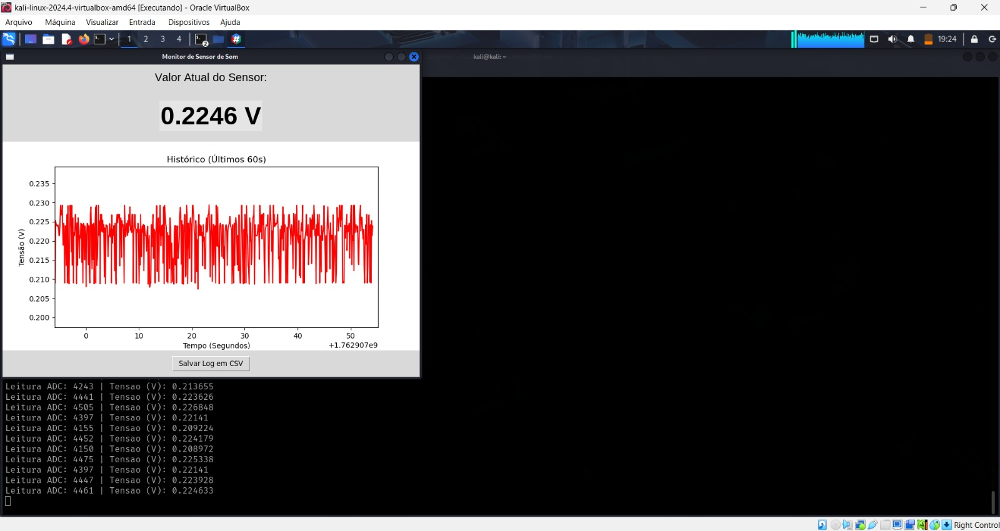
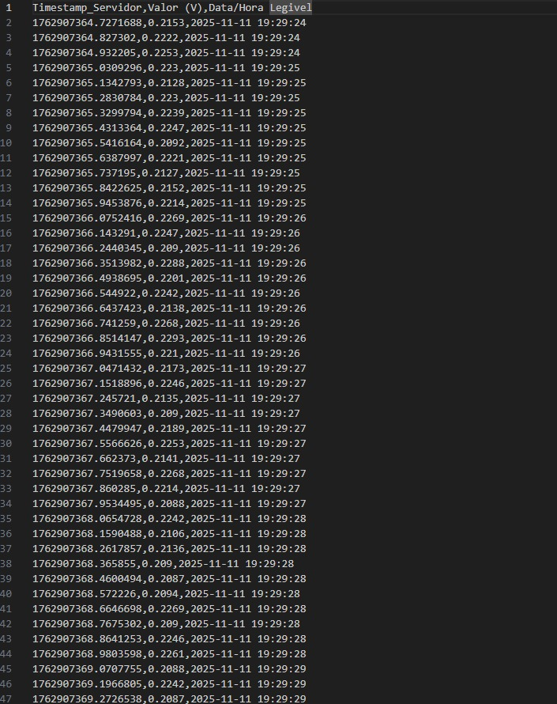

# Descrição Geral do Projeto

Na busca de proteger e monitorar uma carga contra os riscos de violação, roubo ou falha, o presente proejto tem como objtivo detalhar o controles necessários para o monitoramente sonoro dos possíveis problemas de transporte utilizando um Módulo Sensor Detector de Som - Analógico ou Digital (KY-037) conectado a uma placa de desenvolvimento STM32MP1 DK1, que ao final do projeto receberá os sensores restantes.

Para criar esse monitoramento. Embarcamos no kit de desenvolvimento um código em C++ que, em tempo real, mostra os níveis de ruído no ambiente através de uma proporcionalidade entre número total de bits e tensão observada no sensor. Sendo possível determinar qual a tensão referente ao limiar da voz humana e ruídos padrão do transporte. Em seguida, com o uso desses dados será organizada uma plataforma visual para a vizualização e alertas em caso de fuga desses parâmetros estabelecidos.

Além disso, uma **interface visual** exibe dinamicamente os dados, mostrando:

a) **Atualização em tempo real da leitura do sensor**  
b) **Histórico temporal das últimas leituras (60 s)**  
c) **Salvamento do histórico em arquivos de log (CSV)**  

Portanto, Este projeto implementa em C++ a leitura de valores analógicos provenientes de um microfone ou sensor conectado ao pino A4 da placa DK32MP. A leitura é realizada por meio da interface sysfs do Linux embarcado, que expõe os valores crus do ADC (Conversor Analógico-Digital) em arquivos do diretório: /sys/bus/iio/devices/iio:device0/in_voltage13_raw. Com resolução do ADC é de 16 bits (0–65535), com tensão de referência padrão de 3.3 V.

# Instruções de compilação e execução

1. Compilação cruzada no host (Windows)

No terminal (PowerShell ou Git Bash) com o toolchain ARM configurado, execute:

arm-linux-gnueabihf-g++ LeituraSom.cpp -o leitura_som_dk32mp

Isso gera o executável leitura_som_dk32mp, compatível com a arquitetura ARM da placa.

2. Transferência do binário para a DK32MP

Envie o executável para a placa usando scp:

scp leitura_som_dk32mp root@<IP_DK32MP>:/home/root/

Substitua <IP_DK32MP> pelo IP real da sua placa.

3. Execução na DK32MP

Acesse a placa via SSH:

ssh root@<IP_DK32MP>

E execute o programa:

./leitura_som_dk32mp

A tabela de leituras será inicializada.

Para encerrar, pressione Ctrl+C.

nstruções de Compilação e Execução do Sistema

O sistema é composto por um Servidor (script servidor.py em Python, no Linux) e um Cliente (programa LeituraSom.cpp em C++, na placa).

Configuração das Dependências do Servidor (PC Linux)

Este passo só é necessário fazer uma vez. No terminal do Linux, instale o Python, Tkinter e Matplotlib:

sudo apt update
sudo apt install python3 python3-pip python3-tk python3-matplotlib
Configuração do Firewall do Servidor (PC Linux)

Permita que o Linux receba pacotes UDP na porta 4444:

sudo apt install ufw
sudo ufw allow 4444/udp
sudo ufw enable
sudo ufw reload
Atualização do IP do Cliente (Arquivo C++)

Antes de compilar, abra o LeituraSom.cpp e altere a variável TARGET_IP para o endereço IP do seu PC Linux (descubra no Linux com hostname -I).

C++

const char* TARGET_IP = "192.168.42.10"; // <-- MUDE PARA O IP DO SEU LINUX
Compilação cruzada no host (Windows)

No terminal (PowerShell ou Git Bash) com o toolchain ARM configurado, execute:

arm-linux-gnueabihf-g++ LeituraSom.cpp -o leitura_som_dk32mp
Isso gera o executável leitura_som_dk32mp, compatível com a arquitetura ARM da placa.

Transferência do binário para a DK32MP

Envie o executável para a placa usando scp (no terminal do seu Host):

scp leitura_som_dk32mp root@<IP_DK32MP>:/home/root/
Substitua <IP_DK32MP> pelo IP real da sua placa (ex: 192.168.42.2).

Permissão de Execução na DK32MP

Acesse a placa via SSH e dê permissão de execução ao arquivo (só precisa fazer uma vez por transferência):

ssh root@<IP_DK32MP>
chmod +x /home/root/leitura_som_dk32mp
exit
Execução do Servidor (PC Linux) - PASSO 1

O servidor deve ser iniciado PRIMEIRO. No terminal do Linux, navegue até a pasta do projeto e execute o script:

python3 servidor.py
A interface gráfica aparecerá no Linux, mostrando "Aguardando dados...".

Execução do Cliente (Placa DK32MP) - PASSO 2

Com o servidor já rodando, acesse a placa via SSH:

ssh root@<IP_DK32MP>
E execute o programa:

./leitura_som_dk32mp
A interface gráfica no Linux começará a receber os dados e a exibir o gráfico.

Para encerrar, pressione Ctrl+C em ambos os terminais.

# Para gerar a documentação automática com Doxygen e diagramas de classes com Graphviz, instale:

sudo apt-get install doxygen graphviz

Em seguida, execute:

doxygen -g   # gera o arquivo Doxyfile
doxygen Doxyfile

A documentação em HTML e LaTeX/PDF será criada em ./html e ./latex.
Abra o arquivo html/index.html no navegador para visualizar a documentação.

Ao final, a interface deverá exibir resultados da seguinte forma:

Iniciando em branco.

Sendo preenchido gradualmente.

Até estabilizar em um formato tipo janela flutuante.

Além disso, existe a opção de salvar os dados lidos em um log como:

# Estrutura do código

O código é organizado em uma classe LeituraSom, que encapsula a lógica de acesso ao ADC via sysfs.

Classe LeituraSom

Atributos:

adc_path → caminho do arquivo sysfs (/sys/bus/iio/.../in_voltage13_raw)

VREF → tensão de referência (padrão 3.3 V)

RESOLUCAO → resolução do ADC (65535 para 16 bits)

leitura → último valor lido do ADC

Métodos:

ler() → realiza a leitura bruta do ADC

getTensao() → retorna a leitura convertida em volts

getLeitura() → retorna o valor bruto lido

Função main()

Cria um objeto LeituraSom apontando para o canal 13.

Executa leituras contínuas e imprime os valores no terminal.

Inclui uma pausa de 100 ms entre cada leitura (usleep(100000)).

# Dependências necessárias
Compilador C++ compatível com C++11 ou superior.

Toolchain ARM para cross-compilação no host (ex.: arm-linux-gnueabihf-g++).

Acesso ao sysfs do ADC na DK32MP, geralmente disponível em:

/sys/bus/iio/devices/iio:device0/in_voltage13_raw

Doxygen

Graphviz

Headers padrão do C++:

<iostream>
<fstream>
<string>
<unistd.h>
